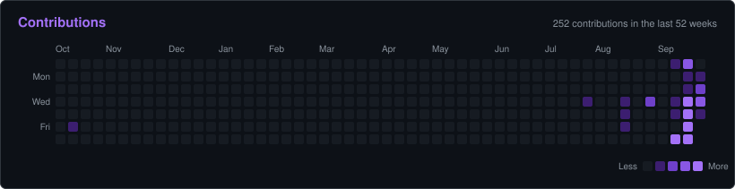
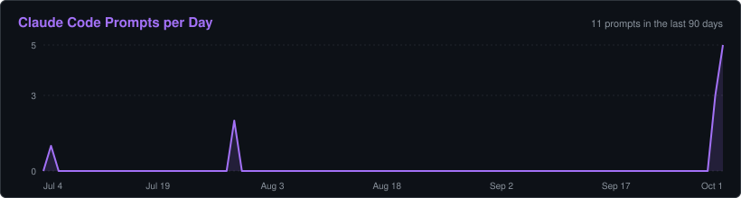
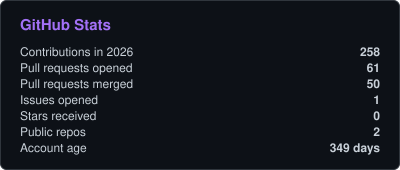
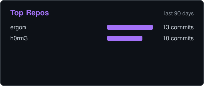

# h0rm3

<p align="center">
  
  
</p>

<p align="center">
  
</p>

<p align="center">
  
</p>

<p align="center">
  
</p>

**Claude Code This Week**

```
🔤 27,216,401 input tokens · 238,632 output tokens
   31,424 fresh · 704,909 cache write · 26,480,068 cache read
🧠 4 sessions · 15 prompts

Opus    13,104,584 tokens  █████████████████████████   47.7%
Sonnet  12,747,641 tokens  ████████████████████████░   46.4%
Haiku    1,602,808 tokens  ███░░░░░░░░░░░░░░░░░░░░░░    5.8%
```

**Claude Code All-Time**

```
🔤 31,619,723 input tokens · 311,861 output tokens
   284,211 fresh · 1,448,689 cache write · 29,886,823 cache read
🧠 7 sessions · 20 prompts
⏱️ 2.9 prompts/session avg · longest session span 20h 42m · busiest hour 09:00 ET
📅 since Jun 25, 2026

Opus    13,900,750 tokens  █████████████████████████   43.5%
Sonnet  13,163,073 tokens  ████████████████████████░   41.2%
Fable    3,264,953 tokens  ██████░░░░░░░░░░░░░░░░░░░   10.2%
Haiku    1,602,808 tokens  ███░░░░░░░░░░░░░░░░░░░░░░    5.0%
```

**Top Tools**

```
🛠️ 342 tool calls, all time

Bash             115 calls  █████████████████████████   33.6%
PowerShell        60 calls  █████████████░░░░░░░░░░░░   17.5%
Write             54 calls  ████████████░░░░░░░░░░░░░   15.8%
Read              45 calls  ██████████░░░░░░░░░░░░░░░   13.2%
Edit              35 calls  ████████░░░░░░░░░░░░░░░░░   10.2%
TaskCreate        14 calls  ███░░░░░░░░░░░░░░░░░░░░░░    4.1%
TaskUpdate         5 calls  █░░░░░░░░░░░░░░░░░░░░░░░░    1.5%
Agent              3 calls  █░░░░░░░░░░░░░░░░░░░░░░░░    0.9%
Other (7 tools)   11 calls  ██░░░░░░░░░░░░░░░░░░░░░░░    3.2%
```

**I'm a Daytime builder, most active on Wednesday** <sub>(commits + AI prompts on record)</sub>

```
🌞 Morning  34 events  ██████████████████░░░░░░░   27.6%
🌆 Daytime  47 events  █████████████████████████   38.2%
🌃 Evening  26 events  ██████████████░░░░░░░░░░░   21.1%
🌙 Night    16 events  █████████░░░░░░░░░░░░░░░░   13.0%

Monday       6 events  ███░░░░░░░░░░░░░░░░░░░░░░    4.9%
Tuesday      6 events  ███░░░░░░░░░░░░░░░░░░░░░░    4.9%
Wednesday   46 events  ████████████████████████░   37.4%
Thursday    39 events  █████████████████████░░░░   31.7%
Friday       9 events  █████░░░░░░░░░░░░░░░░░░░░    7.3%
Saturday    14 events  ███████░░░░░░░░░░░░░░░░░░   11.4%
Sunday       3 events  ██░░░░░░░░░░░░░░░░░░░░░░░    2.4%
```

<p align="center">
  
  
</p>

<p align="center">
  
</p>

<p align="center"><sub>Last updated Oct 1, 2026, 9:19 AM EDT</sub><br><sub>AI stats from local Claude Code and Codex logs</sub></p>
